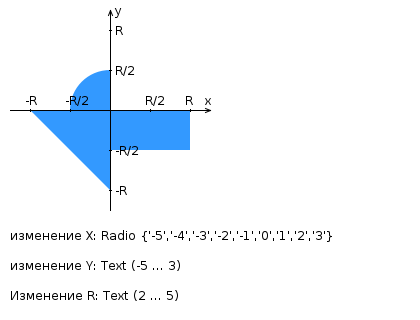

# My option: 77772

[Link](https://se.ifmo.ru/~s502362/1/lab1.html)

# Лабораторная работа #2

Доработать ЛР №1 и разработать FastCGI сервер на языке Java, определяющий попадание точки на координатной плоскости в заданную область, и создать HTML-страницу, которая формирует данные для отправки их на обработку этому серверу.

Параметр R и координаты точки должны передаваться серверу посредством HTTP-запроса. Сервер должен выполнять валидацию данных и возвращать HTML-страницу с таблицей, содержащей полученные параметры и результат вычислений — факт попадания или непопадания точки в область (допускается в ответе сервера возвращать json строку, вместо html-страницы). Предыдущие результаты должны сохраняться между запросами и отображаться в таблице.

Кроме того, ответ должен содержать данные о текущем времени и времени работы скрипта.

**Комментарии по выполнению ЛР**:

- Требуется поднять Apache httpd веб-сервер от лица своего пользователя на гелиосе (шаблон файла конфигурации доступен для скачивания наверху страницы)
- Веб-сервер должен заниматься обслуживанием статического контента (html, css, js) и перенаправлять запросы за динамическим контентом к FastCGI серверу
- FastCGI сервер требуется реализовать на языке Java (полезная библиотека в помощь в виде jar архива доступна для скачивания наверху страницы) и поднять также на гелиосе
- Путем обращений из JavaScript к FastCGI серверу требуется показать понимание принципа AJAX

**Разработанная HTML-страница должна удовлетворять следующим требованиям (дополнительными, по отношению к ЛР №1, различаются по варианту)**:

- Данные формы должны передаваться на обработку посредством POST-запроса.

---

Вопросы к защите лабораторной работы:

1. Синхронная и асинхронная обработка HTTP-запросов. AJAX.
1. Библиотека jQuery. Назначение, основные API. Использование для реализации AJAX и работы с DOM.
1. Реализация AJAX с помощью SuperAgent.
1. Серверные сценарии. CGI - определение, назначение, ключевые особенности.
1. FastCGI - особенности технологии, преимущества и недостатки относительно CGI.
1. FastCGI сервер на языке Java.
